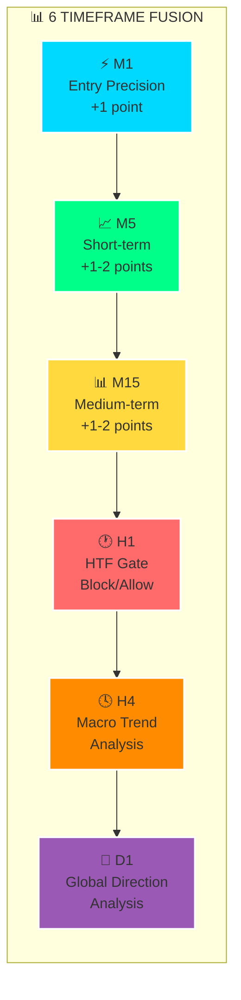
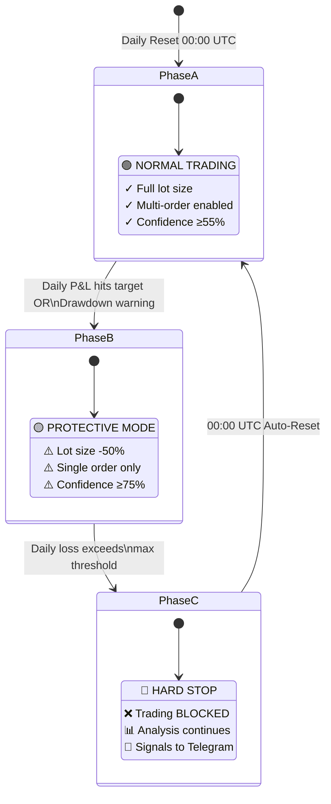
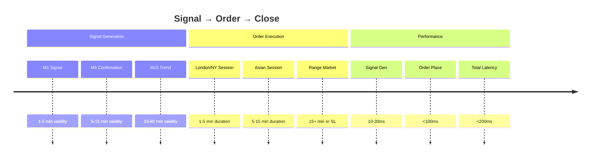

<div align="center">

# 🚀 QuantCore Pro

### **Institutional AI Trading System**

[](https://python.org)
[](https://www.metatrader5.com)
[](https://telegram.org)
[](LICENSE)

**XAUUSDm** • **BTCUSDm** • **Exness MT5**


---

### 🎯 Quick Stats

| 📈 Assets | ⏱️ Timeframes | 🎯 Confidence | ⚡ Latency |
|:---------:|:-------------:|:-------------:|:----------:|
| **2** | **6** | **0-98%** | **<200ms** |
| XAU + BTC | M1→D1 | Neural Score | P95 |

</div>

---

## 🌟 Overview

**QuantCore Pro** is a production-grade algorithmic trading system for Exness MetaTrader 5. It executes independent **multi-timeframe scalping strategies** for Gold (XAU) and Bitcoin (BTC) with institutional-level risk management and AI-powered analysis.

<table>
<tr>
<td width="50%">

### ✨ Core Features

| Feature | Description |
|:--------|:------------|
| 🎯 **Dual-Asset** | XAU & BTC parallel trading |
| 🧠 **AI Scoring** | 6-layer ensemble model |
| 📊 **MTF Analysis** | M1, M5, M15, H1, H4, D1 |
| 🛡️ **Risk Regime** | Adaptive A/B/C phases |

</td>
<td width="50%">

### ⚡ Performance

| Feature | Description |
|:--------|:------------|
| 🎯 **Sniper Filters** | Volume, spread gates |
| ⚡ **Non-Blocking** | Decoupled Telegram |
| 🤖 **Bot Control** | Real-time dashboard |
| 📈 **God Tier** | High-prob detection |

</td>
</tr>
</table>

---

## 🏗️ System Architecture

```mermaid
flowchart TB
    subgraph INPUT["📥 DATA LAYER"]
        MT5["🔌 MT5 API<br/>Exness"]
        FEED["📊 Data Feed<br/>M1-D1 Bars"]
        CACHE["💾 Rate Cache<br/>800 bars"]
    end

    subgraph FEATURE["⚙️ FEATURE ENGINE"]
        direction LR
        EMA["📈 EMA<br/>9/21/50/200"]
        RSI["📊 RSI<br/>Period 14"]
        ADX["📉 ADX<br/>Trend 14"]
        MACD["🔄 MACD<br/>12/26/9"]
    end

    subgraph PATTERN["🔍 PATTERN DETECTION"]
        direction LR
        FVG["🕳️ FVG<br/>Gaps"]
        SWEEP["💧 Liquidity<br/>Sweep"]
        OB["📦 Order<br/>Block"]
        RN["🎯 Round<br/>Numbers"]
    end

    subgraph SIGNAL["🧠 SIGNAL ENGINE"]
        ENS["🎲 Ensemble Score<br/>net: -1 to +1"]
        MTF["📊 MTF Alignment<br/>Score: 0-6/6"]
        CONF["🎯 Confidence Calculator<br/>Output: 0-98%"]
    end

    subgraph FILTER["🎯 SNIPER FILTERS"]
        direction LR
        VOL["✓ Volume"]
        SPR["✓ Spread"]
        TICK["✓ Tick Fresh"]
        ANOM["✓ Anomaly"]
    end

    subgraph RISK["🛡️ RISK MANAGER"]
        direction LR
        PA["🟢 Phase A<br/>Normal"]
        PB["🟡 Phase B<br/>Protective"]
        PC["🔴 Phase C<br/>STOP"]
    end

    subgraph EXEC["⚡ EXECUTION"]
        ORD["📝 Order Executor<br/>MT5_LOCK • ATR SL/TP"]
        TG["📱 Telegram Bot<br/>Notifications"]
    end

    MT5 --> FEED --> CACHE
    CACHE --> FEATURE
    EMA & RSI & ADX & MACD --> PATTERN
    FVG & SWEEP & OB & RN --> SIGNAL
    ENS --> MTF --> CONF
    CONF --> FILTER
    VOL & SPR & TICK & ANOM --> RISK
    PA & PB & PC --> EXEC
    ORD <--> TG

    style INPUT fill:#1a1a2e,stroke:#00d9ff,stroke-width:2px
    style FEATURE fill:#16213e,stroke:#00ff88,stroke-width:2px
    style PATTERN fill:#0f3460,stroke:#ff6b6b,stroke-width:2px
    style SIGNAL fill:#1a1a2e,stroke:#ffd93d,stroke-width:2px
    style FILTER fill:#16213e,stroke:#6bcb77,stroke-width:2px
    style RISK fill:#0f3460,stroke:#ff8c00,stroke-width:2px
    style EXEC fill:#1a1a2e,stroke:#4ecdc4,stroke-width:2px
```



---

## 🧠 AI Neural Scoring System

### Multi-Timeframe Analysis (MTF)



### MTF Score Interpretation

| Score | Alignment | Confidence Effect |
|:-----:|:----------|:------------------|
| **6/6** | 🟢 Perfect | +5% boost |
| **5/6** | 🟢 Strong | +3% boost |
| **4/6** | 🟡 Good | +1% boost |
| **2/6** | 🔴 Weak | -10% penalty |

### Ensemble Score Components

| Component | Description | Range |
|:----------|:------------|:------|
| **Net Score** | Weighted indicator fusion | `-1.0` to `+1.0` |
| **Divergence** | RSI/MACD price divergence | `bullish/bearish/none` |
| **Confluence** | Sweep + Divergence combo | Boost multiplier |
| **Extreme Guard** | Overbought/oversold filter | `Block/Allow` |

### Confidence Calculation

```python
# Base confidence from ensemble
net_norm, conf = _ensemble_score(indicators, book, tick_stats)

# Confluence boost (sweep + divergence)
if has_confluence and net_abs >= 0.15:
    conf = min(92, conf * 1.12)  # +12% boost

# MTF alignment adjustment  
if mtf_score >= 6:
    conf = min(98, conf * 1.05)  # Perfect: +5%
elif mtf_score <= 2:
    conf = max(0, conf * 0.90)   # Weak: -10%

# Strength caps
if net_abs < 0.08:  conf = min(80, conf)
if net_abs < 0.12:  conf = min(88, conf)
if net_abs < 0.18:  conf = min(95, conf)
```

### 🎯 God Tier Detection

> **Rare, high-probability setups identified when all conditions align:**

| Condition | 🟢 Buy | 🔴 Sell |
|:----------|:-------|:--------|
| Order Block | `bull_ob` | `bear_ob` |
| RSI Zone | `< 35` (oversold) | `> 65` (overbought) |
| Divergence | Bullish | Bearish |
| H1 Trend | Not bearish | Not bullish |

---

## 🛡️ Risk Management: 3-Phase Regime

> The system enforces adaptive risk limits that **reset daily at 00:00 UTC**.



### 🟢 Phase A: Normal Trading

| Parameter | XAU | BTC |
|:----------|:---:|:---:|
| Confidence Threshold | `≥55%` | `≥55%` |
| Max Lot | `0.05` | `0.01` |
| Multi-Order | Up to 3 | Up to 2 |
| Daily Loss Limit | `2%` | `3%` |

### 🟡 Phase B: Protective Mode

| Parameter | Change |
|:----------|:-------|
| Lot Size | Reduced `50%` |
| Confidence | `≥75%` required |
| Multi-Order | Disabled (max 1) |

### 🔴 Phase C: Hard Stop

| Behavior | Description |
|:---------|:------------|
| Trading | **Completely blocked** |
| Analysis | Still runs (monitoring) |
| Signals | Sent to Telegram (no execution) |
| Reset | Automatic at `00:00 UTC` |

---

## 🎯 Sniper Filter System

> All signals pass through **institutional-grade filters**:

```mermaid
flowchart LR
    subgraph FILTERS["🎯 5-LAYER FILTER CHAIN"]
        direction TB
        F1["📊 Volume Filter<br/>≥80% of MA"]
        F2["📈 MTF Gate<br/>Trend alignment"]
        F3["💰 Spread Filter<br/>Max spread check"]
        F4["⏱️ Tick Freshness<br/><5 seconds"]
        F5["🚨 Anomaly Detection<br/>Manipulation guard"]
    end

    SIG["📥 Raw<br/>Signal"] --> F1
    F1 --> |PASS| F2
    F2 --> |PASS| F3
    F3 --> |PASS| F4
    F4 --> |PASS| F5
    F5 --> |PASS| EXE["✅ Execute<br/>Order"]

    F1 --> |REJECT| REJ["❌ Rejected"]
    F2 --> |REJECT| REJ
    F3 --> |REJECT| REJ
    F4 --> |REJECT| REJ
    F5 --> |REJECT| REJ

    style FILTERS fill:#1a1a2e,stroke:#00d9ff,stroke-width:2px
    style SIG fill:#ffd93d,stroke:#fff,stroke-width:2px
    style EXE fill:#00ff88,stroke:#fff,stroke-width:2px
    style REJ fill:#ff6b6b,stroke:#fff,stroke-width:2px
```



<details>
<summary><b>📋 Filter Code Details</b></summary>

### 1. Volume Filter
```python
# Skip check for first 15 seconds of new bar
if bar_age_sec < 15.0:
    pass  # Volume still building
else:
    if current_vol < vol_ma * 0.8:
        return REJECT("low_volume", "sniper_reject")
```

### 2. MTF Gate
```python
# Buy requires M5 bullish AND M15 NOT bearish
trend_ok_buy = m5_bullish and (not m15_bearish)

# Sell requires M5 bearish AND M15 NOT bullish  
trend_ok_sell = m5_bearish and (not m15_bullish)
```

### 3. Spread Filter
```python
if spread_pct > max_spread_pct:
    return REJECT("spread_high", "risk_block")
```

### 4. Tick Freshness
```python
if tick_age_sec > 5.0:
    return REJECT("stale_data", "data_block")
```

### 5. Anomaly Detection
- Range spike detection
- Wick spike (manipulation)
- Gap jump detection
- Stop-run rejection

</details>

---

## 📊 Signal Lifecycle



---

## 💬 Telegram Bot Dashboard

<div align="center">

### 📱 Control Panel

| Button | Function |
|:------:|:---------|
| ✅ **Оғоз** | Start trading |
| 🛑 **Қатъ** | Stop trading (monitoring mode) |
| 📊 **Статус** | Engine status |
| 💰 **Баланс** | Account balance |
| 📈 **Таърих** | Trading history |
| 🤖 **AI** | AI analysis menu |

</div>

### 📋 Commands

| Command | Description |
|:--------|:------------|
| `/start` | Welcome + control panel |
| `/status` | Live engine status |
| `/balance` | Account balance |
| `/history` | Full trading history |
| `/ai` | AI market analysis |
| `/buttons` | Show control panel |

### 🔔 Notifications

| Event | Format |
|:------|:-------|
| 🟢 **Buy Signal** | Asset, Price, SL/TP, Confidence% |
| 🔴 **Sell Signal** | Asset, Price, SL/TP, Confidence% |
| 💰 **Trade Closed** | Profit/Loss, Duration |
| 🔄 **Phase Change** | A→B, B→C with reason |
| 🛑 **Hard Stop** | Automatic block alert |

---

## ⚙️ Technical Specifications

<table>
<tr>
<td width="33%">

### 📡 Signal Engine
| Component | Spec |
|:----------|:-----|
| Timeframes | M1→D1 |
| Indicators | EMA, RSI, ADX, MACD |
| Patterns | FVG, Sweep, OB |
| Confidence | 0-98% |

</td>
<td width="33%">

### ⚡ Execution
| Parameter | Value |
|:----------|:------|
| SL/TP | ATR-based |
| Default Lot | 0.02 |
| Default TP | +$5 |
| Max Slippage | 20 pts |

</td>
<td width="33%">

### 📊 Pipeline
| Metric | Value |
|:-------|:------|
| Loop Interval | ~2s |
| Tick Threshold | 5s |
| Bar Cache | 800 |
| P95 Latency | <200ms |

</td>
</tr>
</table>

---

## 🚀 Quick Start

### Prerequisites

```
✓ Python 3.12+
✓ MetaTrader 5 (Exness Terminal)
✓ Windows OS (MT5 requirement)
```

### Installation

```bash
git clone <repo>
cd Exness
pip install -r requirements.txt
```

### Configuration (.env)

```ini
EXNESS_LOGIN=12345678
EXNESS_PASSWORD=your_password
EXNESS_SERVER=Exness-MT5Real
BOT_TOKEN=123456:ABC-DEF...
ADMIN_ID=987654321
```

### Run

```bash
# Full mode (with Telegram)
python main.py

# Headless mode (VPS)
python main.py --headless

# Engine only (no Telegram)
python main.py --engine-only
```

---

## 📊 Monitoring & Logs

### Log Files

| File | Content |
|:-----|:--------|
| `portfolio_engine_health.log` | Pipeline stages, signals, orders |
| `portfolio_engine_error.log` | Errors and exceptions |
| `portfolio_engine_diag.jsonl` | Diagnostic JSON data |

### Log Patterns

```log
PIPELINE_STAGE | step=market_data ok_xau=True age_xau=0.1s
PIPELINE_STAGE | step=signals asset=XAU signal=Buy confidence=87
ORDER_SELECTED | asset=XAU signal=Buy conf=87 lot=0.02
TRADE_CLOSED | asset=XAU profit=+$5.20 duration=3m
PHASE_CHANGE | asset=XAU old=A new=B reason=daily_target
```

### Understanding Signals

```
reasons=net:-0.380,mtf:1/6,phase:A
        │         │       │
        │         │       └── Risk phase (A=normal)
        │         └── MTF alignment (1 of 6)
        └── Net score (bearish -0.38)
```

---

## ✅ Production Readiness

| Feature | Status | Details |
|:--------|:------:|:--------|
| Monday Wake-Up | ✅ | Auto-detects market open |
| 00:00 UTC Reset | ✅ | Daily stats & phases reset |
| Concurrency | ✅ | `MT5_LOCK` protects all API |
| Non-Blocking | ✅ | Telegram decoupled |
| Stale Data Guard | ✅ | 5-second tick freshness |
| Dynamic Sleep | ✅ | Skips when catching up |

---

## ⚠️ Risk Disclaimer

> [!CAUTION]
> **HIGH RISK INVESTMENT WARNING**
>
> This software is for educational and research purposes. Financial trading involves significant risk of loss.
>
> - **No Guarantee**: Past performance does not indicate future results
> - **Software Risk**: Bugs, network issues, or broker rejections can cause losses
> - **Market Risk**: Volatile markets can result in rapid capital loss
> - **Liability**: Authors assume no responsibility for financial damages
>
> **USE AT YOUR OWN RISK**

---

<div align="center">

## 👨‍💻 Author


| | |
|:---:|:---|
| 👤 | **Gafurov Kabir** |
| 🐍 | Python Developer \| Django Back-end |
| 📊 | XAU • BTC • USD \| Trade Analyst |
| 🏢 | Exness MT5 \| Global Markets |
| 🇹🇯 | Tajikistan |
| 📅 | 2026 |

---

### ⚡ Built with precision for institutional-grade execution ⚡

**QuantCore Pro** — *Where AI meets Trading*


</div>