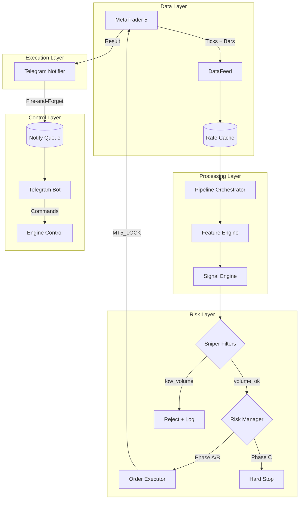

# QuantCore: Institutional Scalping System
## XAUUSDm • BTCUSDm • Exness MT5

```
██████╗ ██╗   ██╗ █████╗ ███╗   ██╗████████╗ ██████╗ ██████╗ ██████╗ ███████╗
██╔═══██╗██║   ██║██╔══██╗████╗  ██║╚══██╔══╝██╔════╝██╔═══██╗██╔══██╗██╔════╝
██║   ██║██║   ██║███████║██╔██╗ ██║   ██║   ██║     ██║   ██║██████╔╝█████╗  
██║▄▄ ██║██║   ██║██╔══██║██║╚██╗██║   ██║   ██║     ██║   ██║██╔══██╗██╔══╝  
╚██████╔╝╚██████╔╝██║  ██║██║ ╚████║   ██║   ╚██████╗╚██████╔╝██║  ██║███████╗
 ╚══▀▀═╝  ╚═════╝ ╚═╝  ╚═╝╚═╝  ╚═══╝   ╚═╝    ╚═════╝ ╚═════╝ ╚═╝  ╚═╝╚══════╝
```

**Production-grade algorithmic trading system** for Exness MetaTrader 5. Executes independent multi-timeframe scalping strategies for **Gold** and **Bitcoin** with institutional-level risk management.

---

## 🎯 Key Features

| Feature | Description |
|---------|-------------|
| **Dual-Asset Trading** | XAU and BTC run independently in parallel |
| **3-Phase Risk Regime** | Adaptive A/B/C system with automatic UTC reset |
| **Sniper Filters** | Volume, momentum, and spread validation gates |
| **Non-Blocking I/O** | Telegram decoupled from trading loop |
| **Tick-Level Freshness** | Real-time data age validation (5s threshold) |
| **AI Integration** | Gemini-powered market analysis (optional) |

---

## 🏗️ System Architecture



---

## 🧵 Threading Model

| Thread | Purpose | Blocking |
|--------|---------|----------|
| `engine.supervisor` | Main trading loop | ❌ Never waits for Telegram |
| `telegram.supervisor` | Bot polling (infinity_polling) | Independent |
| `engine.notify_worker` | Fire-and-forget notifications | Async queue consumer |
| `order_executor` | MT5 order execution | Uses MT5_LOCK |

**Key Optimization**: Engine notifications use `notify_async()` queue - trading loop never blocks on Telegram network issues.

---

## 🛡️ Risk Management: 3-Phase Regime

The system enforces adaptive risk limits that reset daily at **00:00 UTC**.

### 🟢 Phase A: Normal Trading
| Parameter | XAU | BTC |
|-----------|-----|-----|
| Confidence Threshold | ≥85% | ≥60% |
| Max Lot | 0.05 | 0.01 |
| Multi-Order | Up to 3 | Up to 2 |
| Daily Loss Limit | 2% | 3% |

### 🟡 Phase B: Protective Mode
**Trigger**: Daily P&L hits ±target OR drawdown exceeds warning threshold

| Parameter | Change |
|-----------|--------|
| Lot Size | Reduced 50% |
| Confidence | ≥90% required |
| Multi-Order | Disabled (max 1) |

### 🔴 Phase C: Hard Stop
**Trigger**: Daily loss exceeds max threshold (5% XAU / 6% BTC)

| Behavior | Description |
|----------|-------------|
| Trading | **Completely blocked** |
| Analysis | Still runs (monitoring mode) |
| Reset | Automatic at 00:00 UTC |

---

## 🎯 Sniper Filter System

All signals pass through institutional-grade filters before execution:

### 1. Volume Filter
```python
if current_vol < vol_ma * 0.8:
    return REJECT("low_volume", "sniper_reject")
```
- Compares current tick volume to 20-period MA
- Prevents trading in thin/illiquid markets
- **Night sessions**: Typically blocked due to low volume

### 2. Spread Filter
```python
if spread_usd > max_spread_usd:
    return REJECT("spread_high", "risk_block")
```
- XAU: Dynamic based on ATR
- BTC: Max $25 USD

### 3. Momentum Confirmation
```python
if momentum_confirms < min_required:
    return REJECT("weak_momentum", "sniper_reject")
```
- Requires multiple timeframe alignment
- Prevents chasing exhausted moves

### 4. Tick Freshness
```python
if tick_age_sec > 5.0:
    return REJECT("stale_data", "data_block")
```
- Uses real tick timestamps, not bar age
- Ensures signals use fresh market data

---

## 💬 Telegram Dashboard

### Commands
| Command | Description |
|---------|-------------|
| `/start` | Welcome + control panel |
| `/status` | Live engine status, phases, latency |
| `/balance` | Account balance and equity |
| `/history` | Full trading history report |
| `/ai` | AI market analysis menu |
| `/helpers` | Quick TP/SL and order tools |

### Notifications
- 🟢🔴 **Order opened**: Direction, price, SL/TP, confidence
- 🔄 **Phase change**: A→B, B→C transitions with reason
- 🛑 **Hard stop**: Automatic and manual stop alerts
- 🌅 **Daily start**: New trading day confirmation

### Non-Blocking Design
```python
# Engine uses fire-and-forget queue
notify_async(ADMIN, message)  # Never blocks

# Separate worker thread handles delivery
engine.notify_worker → Telegram API
```

---

## ⚙️ Technical Specifications

### Signal Engine
| Component | Specification |
|-----------|---------------|
| Timeframes | M1, M5, M15 (multi-TF fusion) |
| Models | Trend, Momentum, MeanRev, Structure, Volume |
| Meta Gate | Probability barrier (0.40 threshold) |
| Confidence | 0-100% normalized output |

### Order Execution
| Parameter | Value |
|-----------|-------|
| SL/TP Calculation | ATR-based with structure zones |
| Min R:R Ratio | 1:1.5 |
| P95 Latency Limit | 550ms |
| Max Slippage | 20 points |

### Data Pipeline
| Metric | Target |
|--------|--------|
| Loop Interval | ~2 seconds |
| Tick Age Threshold | 5 seconds |
| Bar Cache | 800 bars per asset |
| Dynamic Sleep | Skips sleep if data stale |

---

## � Quick Start

### Prerequisites
- Python 3.12+
- MetaTrader 5 (Exness Terminal)
- Windows OS (MT5 requirement)

### Installation
```bash
git clone <repo>
cd Exness
pip install -r requirements.txt
```

### Configuration (.env)
```ini
EXNESS_LOGIN=12345678
EXNESS_PASSWORD=your_password
EXNESS_SERVER=Exness-MT5Real
BOT_TOKEN=123456:ABC-DEF...
ADMIN_ID=987654321
```

### Run
```bash
# Full mode (with Telegram)
python main.py

# Headless mode (VPS)
python main.py --headless

# Engine only (no Telegram)
python main.py --engine-only
```

---

## 📊 Monitoring & Logs

### Log Files
| File | Content |
|------|---------|
| `portfolio_engine_health.log` | Pipeline stages, signals, orders |
| `portfolio_engine_error.log` | Errors and exceptions |
| `portfolio_engine_diag.jsonl` | Diagnostic JSON data |

### Key Log Patterns
```
PIPELINE_STAGE | step=market_data ok_xau=True age_xau=0.1s
PIPELINE_STAGE | step=signals asset=XAU signal=Buy confidence=0.87
ORDER_SELECTED | asset=XAU signal=Buy conf=0.87 lot=0.02
TRADE_CLOSED | asset=XAU cooldown_started=120s
PHASE_CHANGE | asset=XAU old=A new=B reason=daily_target
```

---

## ✅ Production Readiness

| Audit Item | Status | Details |
|------------|--------|---------|
| Monday Wake-Up | ✅ | Auto-detects market open via `is_market_open()` |
| 00:00 UTC Reset | ✅ | Daily stats and risk phases reset in-memory |
| Concurrency | ✅ | `MT5_LOCK` protects all broker API calls |
| Non-Blocking | ✅ | Telegram I/O decoupled from trading loop |
| Stale Data Guard | ✅ | Tick-based freshness check (5s threshold) |
| Dynamic Sleep | ✅ | Skips sleep when data is stale to catch up |

---

## ⚠️ Risk Disclaimer

**HIGH RISK INVESTMENT WARNING**

This software is for educational and research purposes. Financial trading involves significant risk of loss.

- **No Guarantee**: Past performance does not indicate future results
- **Software Risk**: Bugs, network issues, or broker rejections can cause losses
- **Market Risk**: Volatile markets can result in rapid capital loss
- **Liability**: Authors assume no responsibility for financial damages

**USE AT YOUR OWN RISK**

---

## 👨‍💻 Author

Python Developer | Django Back-end | XAU - BTC - USD | Trade Analyst | Exness MT5 | Global Markets |

Developed with ❤️ by Gafurov Kabir 📅 2026 | Tajikistan 🇹🇯
---

*Built with precision for institutional-grade execution* ⚡