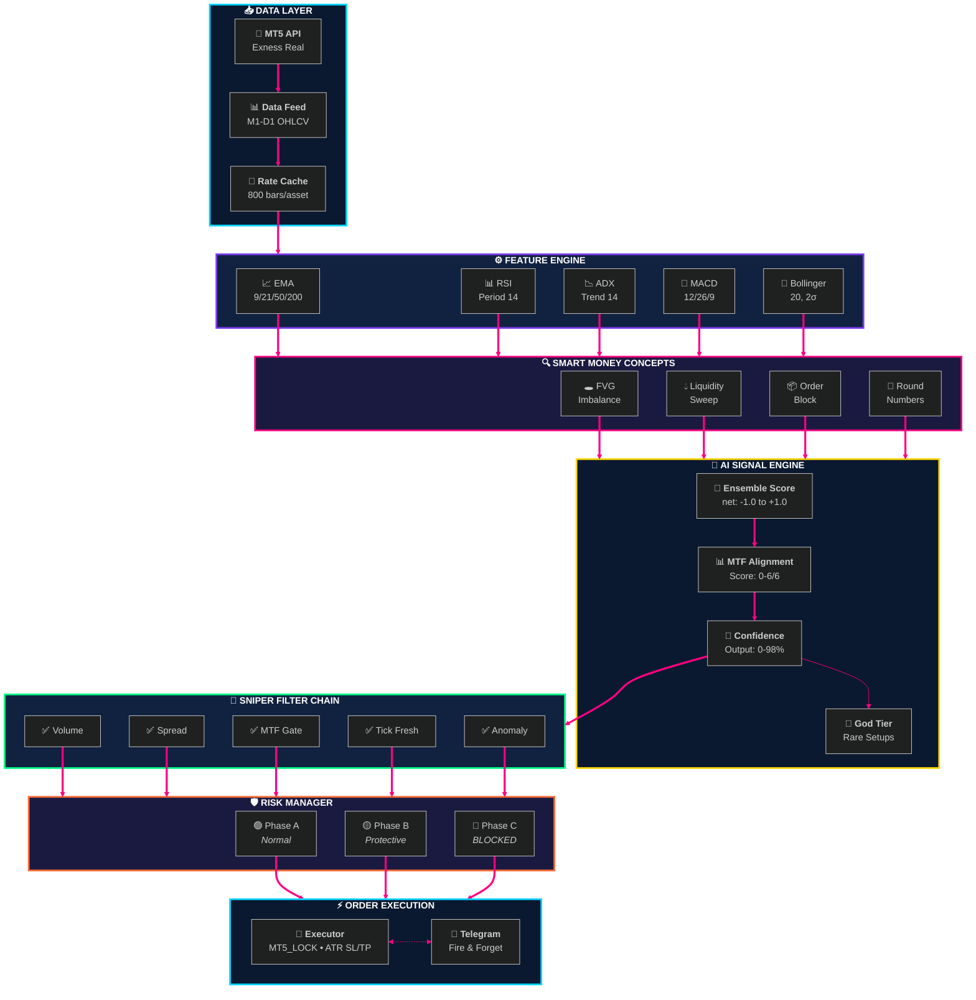
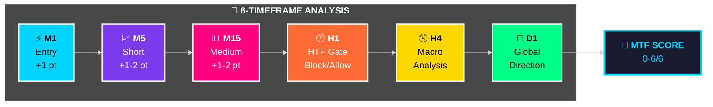
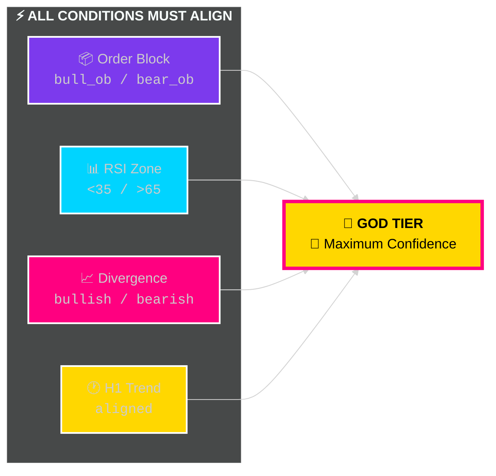
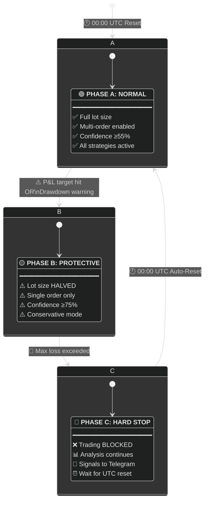

<div align="center">

```
╔══════════════════════════════════════════════════════════════════════════════════╗
║                                                                                  ║
║   ██████╗ ██╗   ██╗ █████╗ ███╗   ██╗████████╗ ██████╗ ██████╗ ██████╗ ███████╗  ║
║  ██╔═══██╗██║   ██║██╔══██╗████╗  ██║╚══██╔══╝██╔════╝██╔═══██╗██╔══██╗██╔════╝  ║
║  ██║   ██║██║   ██║███████║██╔██╗ ██║   ██║   ██║     ██║   ██║██████╔╝█████╗    ║
║  ██║▄▄ ██║██║   ██║██╔══██║██║╚██╗██║   ██║   ██║     ██║   ██║██╔══██╗██╔══╝    ║
║  ╚██████╔╝╚██████╔╝██║  ██║██║ ╚████║   ██║   ╚██████╗╚██████╔╝██║  ██║███████╗  ║
║   ╚══▀▀═╝  ╚═════╝ ╚═╝  ╚═╝╚═╝  ╚═══╝   ╚═╝    ╚═════╝ ╚═════╝ ╚═╝  ╚═╝╚══════╝  ║
║                                                                                  ║
║                        ██████╗ ██████╗  ██████╗                                  ║
║                        ██╔══██╗██╔══██╗██╔═══██╗                                 ║
║                        ██████╔╝██████╔╝██║   ██║                                 ║
║                        ██╔═══╝ ██╔══██╗██║   ██║                                 ║
║                        ██║     ██║  ██║╚██████╔╝                                 ║
║                        ╚═╝     ╚═╝  ╚═╝ ╚═════╝                                  ║
║                                                                                  ║
║           🏆 INSTITUTIONAL AI TRADING SYSTEM 🏆                                  ║
║                                                                                  ║
║       🤖 AI-Powered Gold & Bitcoin Trading                                       ║
║       ⚡ Sub-200ms Execution Speed                                               ║
║       💎 Institutional-Grade Risk Management                                     ║
║                                                                                  ║
╚══════════════════════════════════════════════════════════════════════════════════╝
```

<br/>

<!-- ANIMATED BADGES -->
<a href="#"></a>
<a href="#"></a>
<a href="#"></a>

<br/><br/>

<!-- TECH STACK BADGES -->


<br/><br/>

<!-- STATS CARDS -->
<table>
<tr>
<td align="center">
<br/>
<sub><b>XAU + BTC</b></sub>
</td>
<td align="center">
<br/>
<sub><b>M1 → D1</b></sub>
</td>
<td align="center">
<br/>
<sub><b>Neural Score</b></sub>
</td>
<td align="center">
<br/>
<sub><b>P95</b></sub>
</td>
</tr>
</table>

</div>

---

<div align="center">

## ⚡ CORE FEATURES

</div>

<table>
<tr>
<td width="50%">

### 🎯 Trading Engine

| Feature | Description |
|:-------:|:------------|
| 🤖 | **Dual-Asset Trading** — XAU & BTC parallel |
| 🧠 | **AI Neural Scoring** — 6-layer ensemble |
| 📊 | **MTF Analysis** — M1, M5, M15, H1, H4, D1 |
| 🎯 | **God Tier Detection** — Rare high-prob setups |

</td>
<td width="50%">

### 🛡️ Risk & Control

| Feature | Description |
|:-------:|:------------|
| 🛡️ | **3-Phase Regime** — A/B/C auto-reset |
| 🎯 | **Sniper Filters** — Volume, spread gates |
| ⚡ | **Non-Blocking I/O** — Decoupled Telegram |
| 📱 | **Bot Dashboard** — Full control panel |

</td>
</tr>
</table>

---

<div align="center">

## 🏗️ SYSTEM ARCHITECTURE

</div>



---

<div align="center">

## 🧠 AI NEURAL SCORING

</div>

### 📊 Multi-Timeframe Fusion



<div align="center">

### 🎯 MTF Score Impact

| Score | Status | Effect | Visual |
|:-----:|:------:|:-------|:------:|
| **6/6** | 🟢 Perfect | **+5%** confidence boost | ████████████ |
| **5/6** | 🟢 Strong | **+3%** confidence boost | ██████████░░ |
| **4/6** | 🟡 Good | **+1%** confidence boost | ████████░░░░ |
| **3/6** | 🟡 Neutral | No change | ██████░░░░░░ |
| **2/6** | 🔴 Weak | **-10%** confidence penalty | ████░░░░░░░░ |

</div>

### 🎲 Ensemble Components

<table>
<tr>
<td width="25%" align="center">

🎯 **Net Score**

`-1.0` ↔ `+1.0`

Weighted fusion

</td>
<td width="25%" align="center">

📈 **Divergence**

`bull` / `bear` / `none`

RSI/MACD vs Price

</td>
<td width="25%" align="center">

🔥 **Confluence**

`Sweep + Divergence`

Boost multiplier

</td>
<td width="25%" align="center">

🛡️ **Extreme Guard**

`Block` / `Allow`

OB/OS filter

</td>
</tr>
</table>

### 💻 Confidence Algorithm

```python
# 🧠 Base confidence from ensemble
net_norm, conf = _ensemble_score(indicators, book, tick_stats)

# 🔥 Confluence boost (sweep + divergence)
if has_confluence and net_abs >= 0.15:
    conf = min(92, conf * 1.12)  # +12% boost

# 📊 MTF alignment adjustment  
if mtf_score >= 6:
    conf = min(98, conf * 1.05)  # Perfect: +5%
elif mtf_score <= 2:
    conf = max(0, conf * 0.90)   # Weak: -10%

# 🎯 Strength caps
if net_abs < 0.08:  conf = min(80, conf)  # Weak signal
if net_abs < 0.12:  conf = min(88, conf)  # Moderate
if net_abs < 0.18:  conf = min(95, conf)  # Strong
```

---

<div align="center">

## 👑 GOD TIER DETECTION

**Rare, High-Probability Setups**

</div>



<table align="center">
<tr>
<th>Condition</th>
<th>🟢 BUY Signal</th>
<th>🔴 SELL Signal</th>
</tr>
<tr>
<td><b>📦 Order Block</b></td>
<td><code>bull_ob</code></td>
<td><code>bear_ob</code></td>
</tr>
<tr>
<td><b>📊 RSI Zone</b></td>
<td><code>< 35</code> (oversold)</td>
<td><code>> 65</code> (overbought)</td>
</tr>
<tr>
<td><b>📈 Divergence</b></td>
<td>Bullish</td>
<td>Bearish</td>
</tr>
<tr>
<td><b>🕐 H1 Trend</b></td>
<td>Not bearish</td>
<td>Not bullish</td>
</tr>
</table>

---

<div align="center">

## 🛡️ RISK MANAGEMENT

**3-Phase Adaptive Regime — Auto-Reset at 00:00 UTC**

</div>



<table align="center">
<tr>
<td align="center" width="33%">

### 🟢 Phase A

| Parameter | XAU | BTC |
|:----------|:---:|:---:|
| Confidence | `≥55%` | `≥55%` |
| Max Lot | `0.05` | `0.01` |
| Multi-Order | 3 | 2 |
| Loss Limit | `2%` | `3%` |

</td>
<td align="center" width="33%">

### 🟡 Phase B

| Parameter | Change |
|:----------|:------:|
| Lot Size | `-50%` |
| Confidence | `≥75%` |
| Multi-Order | `1 max` |
| Mode | `Conservative` |

</td>
<td align="center" width="33%">

### 🔴 Phase C

| Behavior | Status |
|:---------|:------:|
| Trading | `BLOCKED` |
| Analysis | `Running` |
| Signals | `Telegram` |
| Reset | `00:00 UTC` |

</td>
</tr>
</table>

---

<div align="center">

## 🎯 SNIPER FILTER CHAIN

**5-Layer Institutional-Grade Validation**

```mermaid
%%{init: {'theme': 'dark'}}%%

flowchart LR
    SIG["📥 <b>RAW SIGNAL</b>"]
    
    subgraph CHAIN["<b>🎯 5-LAYER FILTER CHAIN</b>"]
        F1["📊 <b>VOLUME</b><br/>≥80% of MA<br/><i>Skip first 15s</i>"]
        F2["📈 <b>MTF GATE</b><br/>Trend alignment<br/><i>M5+M15 check</i>"]
        F3["💰 <b>SPREAD</b><br/>Max spread<br/><i>% threshold</i>"]
        F4["⏱️ <b>TICK</b><br/>Freshness<br/><i><5 seconds</i>"]
        F5["🚨 <b>ANOMALY</b><br/>Manipulation<br/><i>Spike guard</i>"]
    end

    SIG ==> F1 ==> F2 ==> F3 ==> F4 ==> F5 ==> EXE["✅ <b>EXECUTE</b>"]

    F1 -.-> |REJECT| REJ["❌"]
    F2 -.-> |REJECT| REJ
    F3 -.-> |REJECT| REJ
    F4 -.-> |REJECT| REJ
    F5 -.-> |REJECT| REJ

    style SIG fill:#7c3aed,stroke:#fff,stroke-width:2px
    style CHAIN fill:#0a192f,stroke:#00d4ff,stroke-width:3px
    style F1 fill:#112240,stroke:#00d4ff,stroke-width:2px
    style F2 fill:#112240,stroke:#7c3aed,stroke-width:2px
    style F3 fill:#112240,stroke:#ff0080,stroke-width:2px
    style F4 fill:#112240,stroke:#ffd700,stroke-width:2px
    style F5 fill:#112240,stroke:#ff6b35,stroke-width:2px
    style EXE fill:#00ff88,stroke:#fff,stroke-width:3px,color:#000
    style REJ fill:#ff0000,stroke:#fff,stroke-width:2px
```

</div>



<details>
<summary><b>📋 Click to View Filter Code</b></summary>

### 1️⃣ Volume Filter
```python
if bar_age_sec < 15.0:
    pass  # Volume still building
else:
    if current_vol < vol_ma * 0.8:
        return REJECT("low_volume", "sniper_reject")
```

### 2️⃣ MTF Gate
```python
trend_ok_buy = m5_bullish and (not m15_bearish)
trend_ok_sell = m5_bearish and (not m15_bullish)
```

### 3️⃣ Spread Filter
```python
if spread_pct > max_spread_pct:
    return REJECT("spread_high", "risk_block")
```

### 4️⃣ Tick Freshness
```python
if tick_age_sec > 5.0:
    return REJECT("stale_data", "data_block")
```

### 5️⃣ Anomaly Detection
- 📊 Range spike detection
- 🕯️ Wick spike (manipulation)
- 📈 Gap jump detection  
- 🛑 Stop-run rejection

</details>

---

<div align="center">

## 💬 TELEGRAM BOT

**Full Control Dashboard**

</div>

<table align="center">
<tr>
<td width="50%">

### 📱 Control Panel

| Button | Function |
|:------:|:---------|
| ✅ **Оғоз** | Start trading |
| 🛑 **Қатъ** | Stop (monitoring) |
| 📊 **Статус** | Engine status |
| 💰 **Баланс** | Account balance |
| 📈 **Таърих** | Trade history |
| 🤖 **AI** | AI analysis |

</td>
<td width="50%">

### 📋 Commands

| Command | Description |
|:--------|:------------|
| `/start` | Welcome panel |
| `/status` | Live status |
| `/balance` | Balance info |
| `/history` | Trade history |
| `/ai` | AI analysis |
| `/buttons` | Show panel |

</td>
</tr>
</table>

### 🔔 Real-Time Notifications

| Event | Format |
|:------|:-------|
| 🟢 **Buy Signal** | Asset • Price • SL/TP • Confidence% |
| 🔴 **Sell Signal** | Asset • Price • SL/TP • Confidence% |
| 💰 **Trade Closed** | P&L • Duration • Result |
| 🔄 **Phase Change** | A→B→C • Reason |
| 🛑 **Hard Stop** | Auto-block alert |

---

<div align="center">

## ⚙️ TECHNICAL SPECS

</div>

<table>
<tr>
<td width="33%" align="center">

### 📡 Signal Engine

| Component | Value |
|:----------|:------|
| Timeframes | `M1→D1` |
| Indicators | `EMA RSI ADX MACD BB` |
| Patterns | `FVG Sweep OB` |
| Confidence | `0-98%` |

</td>
<td width="33%" align="center">

### ⚡ Execution

| Parameter | Value |
|:----------|:------|
| SL/TP | `ATR-based` |
| Default Lot | `0.02` |
| Default TP | `+$5 USD` |
| Slippage | `20 pts max` |

</td>
<td width="33%" align="center">

### 📊 Performance

| Metric | Value |
|:-------|:------|
| Loop | `~2 sec` |
| Tick Age | `<5 sec` |
| Bar Cache | `800/asset` |
| P95 | `<200ms` |

</td>
</tr>
</table>

---

<div align="center">

## 🚀 QUICK START

</div>

### 📋 Prerequisites

```
✅ Python 3.12+
✅ MetaTrader 5 (Exness Terminal)
✅ Windows OS
✅ Telegram Bot Token
```

### 📦 Installation

```bash
git clone <repo>
cd Exness
pip install -r requirements.txt
```

### ⚙️ Configuration (.env)

```ini
EXNESS_LOGIN=12345678
EXNESS_PASSWORD=your_password
EXNESS_SERVER=Exness-MT5Real
BOT_TOKEN=123456:ABC-DEF...
ADMIN_ID=987654321
```

### ▶️ Run

```bash
python main.py              # Full mode
python main.py --headless   # VPS mode
python main.py --engine-only # No Telegram
```

---

<div align="center">

## 📊 MONITORING

</div>

### 📁 Log Files

| File | Content |
|:-----|:--------|
| `portfolio_engine_health.log` | Pipeline • Signals • Orders |
| `portfolio_engine_error.log` | Errors • Exceptions |
| `portfolio_engine_diag.jsonl` | Diagnostic JSON |

### 📋 Log Format

```log
PIPELINE_STAGE | step=market_data ok_xau=True age_xau=0.1s
PIPELINE_STAGE | step=signals asset=XAU signal=Buy confidence=87
ORDER_SELECTED | asset=XAU signal=Buy conf=87 lot=0.02
TRADE_CLOSED   | asset=XAU profit=+$5.20 duration=3m
PHASE_CHANGE   | asset=XAU old=A new=B reason=daily_target
```

---

<div align="center">

## ✅ PRODUCTION READY

</div>

| Feature | Status | Details |
|:--------|:------:|:--------|
| 🌅 Monday Wake-Up | ✅ | Auto-detects market open |
| 🕛 00:00 UTC Reset | ✅ | Daily stats & phases reset |
| 🔒 Concurrency | ✅ | `MT5_LOCK` thread-safe |
| ⚡ Non-Blocking | ✅ | Telegram decoupled |
| 📊 Stale Guard | ✅ | 5-second freshness |
| 💤 Dynamic Sleep | ✅ | Skips when catching up |

---

<div align="center">

## ⚠️ RISK DISCLAIMER

</div>

> [!CAUTION]
> ### ⚠️ HIGH RISK INVESTMENT WARNING
>
> This software is for **educational and research purposes only**.
>
> | Risk Type | Description |
> |:----------|:------------|
> | 📉 **No Guarantee** | Past performance ≠ future results |
> | 💻 **Software Risk** | Bugs, network issues can cause losses |
> | 📈 **Market Risk** | Volatile markets = rapid capital loss |
> | ⚖️ **Liability** | Authors assume NO responsibility |
>
> ### **USE AT YOUR OWN RISK**

---

<div align="center">

## 👨‍💻 AUTHOR

```
╔═══════════════════════════════════════════════════════════════════════╗
║                                                                       ║
║   ██████╗  █████╗ ███████╗██╗   ██╗██████╗  ██████╗ ██╗   ██╗        ║
║  ██╔════╝ ██╔══██╗██╔════╝██║   ██║██╔══██╗██╔═══██╗██║   ██║        ║
║  ██║  ███╗███████║█████╗  ██║   ██║██████╔╝██║   ██║██║   ██║        ║
║  ██║   ██║██╔══██║██╔══╝  ██║   ██║██╔══██╗██║   ██║╚██╗ ██╔╝        ║
║  ╚██████╔╝██║  ██║██║     ╚██████╔╝██║  ██║╚██████╔╝ ╚████╔╝         ║
║   ╚═════╝ ╚═╝  ╚═╝╚═╝      ╚═════╝ ╚═╝  ╚═╝ ╚═════╝   ╚═══╝          ║
║                                                                       ║
║                    ██╗  ██╗ █████╗ ██████╗ ██╗██████╗                 ║
║                    ██║ ██╔╝██╔══██╗██╔══██╗██║██╔══██╗                ║
║                    █████╔╝ ███████║██████╔╝██║██████╔╝                ║
║                    ██╔═██╗ ██╔══██║██╔══██╗██║██╔══██╗                ║
║                    ██║  ██╗██║  ██║██████╔╝██║██║  ██║                ║
║                    ╚═╝  ╚═╝╚═╝  ╚═╝╚═════╝ ╚═╝╚═╝  ╚═╝                ║
║                                                                       ║
╚═══════════════════════════════════════════════════════════════════════╝
```

| | |
|:---:|:---|
| 👤 | **Gafurov Kabir** |
| 🐍 | Python Developer \| Django Backend |
| 📊 | XAU • BTC • USD \| Trade Analyst |
| 🏢 | Exness MT5 \| Global Markets |
| 🇹🇯 | Tajikistan |
| 📅 | 2026 |

---

```
╔═══════════════════════════════════════════════════════════════════════╗
║                                                                       ║
║   ⚡ Built with precision for institutional-grade execution ⚡        ║
║                                                                       ║
║              ╔═══════════════════════════════════════╗                ║
║              ║   Q U A N T C O R E   P R O          ║                ║
║              ║   Where AI Meets Trading 💎           ║                ║
║              ╚═══════════════════════════════════════╝                ║
║                                                                       ║
║   🤖 AI-Powered  •  ⚡ Sub-200ms  •  🛡️ Risk-Managed  •  📱 Telegram  ║
║                                                                       ║
╚═══════════════════════════════════════════════════════════════════════╝
```

**Made with ❤️ in Tajikistan 🇹🇯**

</div>