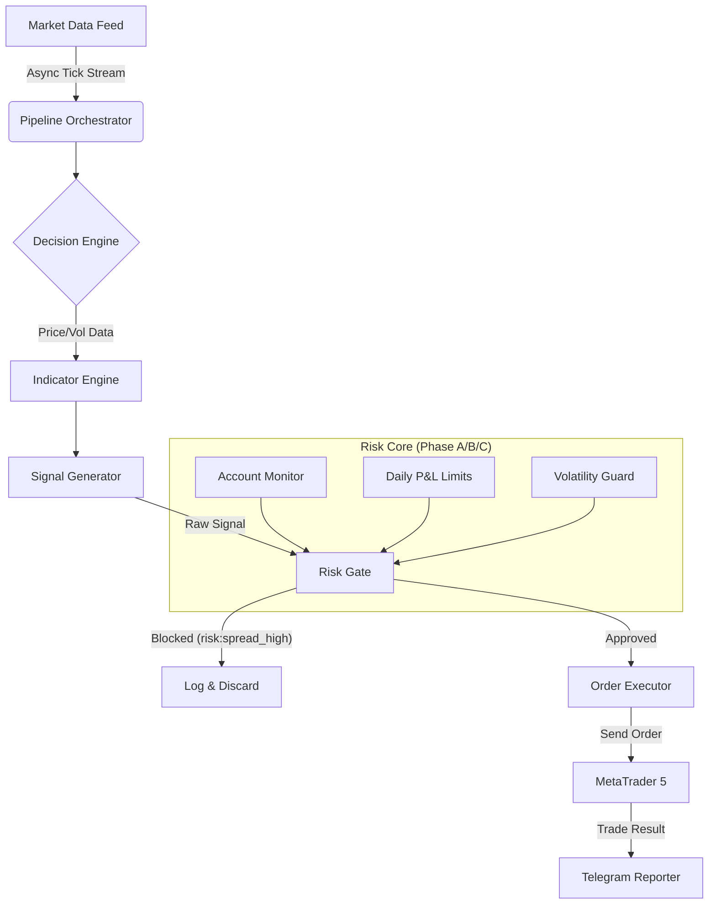

# QuantCore: Institutional Scalping System (XAUUSDm + BTCUSDm)
## 🚀 Executive Summary

**QuantCore** is a production-grade algorithmic trading system engineered for **Exness MetaTrader 5**. It executes independent, multi-timeframe scalping strategies for **Gold (XAUUSDm)** and **Bitcoin (BTCUSDm)** concurrenty. 

The system prioritizes **capital preservation** through a 3-Tier Risk Regime (Phase A/B/C) and features an **AsyncIO** core for sub-second execution. It is designed for private institutional use, offering full transparency via a professional **Telegram Dashboard**.

---

## ⚡ Latest Updates (January 31, 2026)

### **✅ Critical Fixes (Risk & Logic)**
- **Risk Opacity Solved**: `RiskManager` now returns granular rejection codes (e.g., `risk:spread_high`, `risk:low_confidence`, `risk:session_closed`) instead of generic blocks.
- **Zero Confidence Bug Fixed**: `SignalEngine` reinforced with NaN protection. Added `ZERO_CONF_DEBUG` logging to pinpoint failing indicators immediately.
- **Negative Age Fixed**: Data feed pipeline now clamps bar age to `0.0s` minimum, preventing logic errors on fast-ticking markets.

### **✅ Strategy Optimizations**
- **XAU Scalping**: Tuned for **1-15 min** volatility. Meta Gate threshold reduced to `0.40`, Debounce logic relaxed by 40%.
- **BTC Resilience**: Trend checks adapted with **0.02% EMA tolerance** to handle crypto volatility. Spread gate widened to **$25** (USD-based) for realistic execution.
- **Dynamic Confidence**: Variable confidence caps (80-97%) based on signal signal strength (`net_norm`).

---

## 🏗️ System Architecture

The system follows a proprietary **Unidirectional Data Flow** architecture:



---

## 🎮 Telegram Control & Dashboard

The bot provides a professional command center for the administrator.

| Feature | Description |
| :--- | :--- |
| **Admin Guard** | Automatically blocks and logs unauthorized access attempts. |
| **Full History** | `/history` generates a 12-month performance report with open position details. |
| **Live Status** | `/status` shows active regimes (Phase A/B/C), latency, and margin health. |
| **Panic Controls** | `STOP` (Halt Engine) and `FLATTEN` (Close All) buttons for emergency use. |

### Reports
> "Professional reporting with compact visuals, clean separators, and Win/Loss metrics."
- **Daily/Weekly/Monthly**: Includes Profit Factor, Win Rate, and Net P&L.
- **Instant Notifications**: Trade open/close events, Phase transitions, and Hard Stops.

---

## 🛡️ Risk Management (The Core)

The system enforces a **3-Phase Adaptive Regime** that resets daily at **00:00 UTC**.

### 🟢 Phase A: Normal Trading
- **Condition**: Daily P&L within normal bounds.
- **Logic**: Full trading enabled.
- **Confidence**: XAU $\ge$ 85% | BTC $\ge$ 60%.
- **Multi-Order**: Allowed (up to 3 orders) for high-confidence setups.

### 🟡 Phase B: Protective Mode
- **Trigger**: Daily Profit $\ge$ Target (10%) OR Daily Loss $\ge$ 2% (XAU) / 3% (BTC).
- **Logic**: Capital preservation. Lot size reduced by **50%**.
- **Confidence**: Strict $\ge$ 90% required.
- **Multi-Order**: Disabled (Max 1 trade).

### 🔴 Phase C: Hard Stop
- **Trigger**: Daily Loss $\ge$ 5% (XAU) / 6% (BTC).
- **Logic**: **Trading Locked**. No analysis performed.
- **Reset**: Requires automatic UTC midnight reset or manual intervention.

---

## ⚙️ Technical Specifications

### Signal Engine
- **Input**: M1, M5, M15 closed bars.
- **Logic**: Ensemble of 5 weighted models (Trend, Momentum, MeanRev, Structure, Volume).
- **Filters**:
  - **Meta Gate**: Probability barrier check based on historical hit-rate.
  - **Conformal Gate**: Statistical quantiles for R:R validation.
  - **Noise Filter**: ADX and Bollinger Band Squeeze thresholds.

### Order Execution
- **Smart SL/TP**: Calculated via ATR (Volatility) with fallback to Micro-Structure zones.
- **Validation**: Checks `stops_level`, `freeze_level`, and Minimum R:R (1:1.5).
- **Quality Guard**:
  - P95 Latency Limit: 550ms.
  - Max Slippage: 20 points.
  - Max Spread: Dynamic USD cap.

---

## � System Reliability Audit (Deploy-Ready)

**Verified January 31, 2026**: The system has passed a Critical Logic Audit for 24/7 institutional deployment.

| Critical Logic | Audit Result | Verification Detail |
| :--- | :--- | :--- |
| **Monday Wake-Up** | ✅ **Guaranteed** | Logic uses `datetime.utcnow().weekday()` to auto-exit weekend mode. No restart required. |
| **00:00 UTC Reset** | ✅ **Guaranteed** | Daily stats & risk regimes auto-reset in-memory without WebSocket disconnection. |
| **Concurrency** | ✅ **Thread-Safe** | Order execution uses `queue.Queue` + `MT5_LOCK` to safely handle simultaneous XAU/BTC signals. |
| **Non-Blocking** | ✅ **Optimized** | Asset pipelines run in parallel; "Sleeping" XAU does not block BTC execution. |

---

## �🛠️ Installation & Config

### Prerequisites
- Python 3.12+
- MetaTrader 5 (Exness Terminal)

### 1. Setup
```bash
pip install -r requirements.txt
```

### 2. Configuration (.env)
Create a `.env` file with your credentials (only these 5 variables are secret):
```ini
EXNESS_LOGIN=12345678
EXNESS_PASSWORD=your_secret_pass
EXNESS_SERVER=Exness-MT5Real
BOT_TOKEN=123456:ABC-DEF1234ghIkl-zyx57W2v1u123ew11
ADMIN_ID=987654321
```

### 3. Strategy Tuning
Edit `config_xau.py` or `config_btc.py` to adjust:
- `daily_target_pct` (default 0.10)
- `max_risk_per_trade` (default 0.02)
- `min_confidence_signal` (XAU 0.85 / BTC 0.60)

### 4. Run
```bash
python main.py
```
*Use `--headless` for VPS operation without the Telegram bot.*

---

## ⚠️ Disclaimer

**HIGH RISK INVESTMENT WARNING**: 
This software is an educational tool for algorithmic trading research. Financial trading involves significant risk.
- **No Guarantee**: Past performance does not indicate future results.
- **Software Risk**: Bugs, internet failures, or broker rejections can cause losses.
- **Liability**: The authors assume no responsibility for financial damage. **Use at your own risk.**

---

Python Developer | Django Back-end | XAU - BTC - USD | Trade Analyst | Exness MT5 | Global Markets |

Developed with ❤️ by Gafurov Kabir 📅 2026 | Tajikistan 🇹🇯