<div align="center">

```
        ╔════════════════════════════════════════════════════════════════════════════════════════════╗
        ║                                                                                            ║
        ║         ██████╗ ██╗   ██╗ █████╗ ███╗   ██╗████████╗ ██████╗ ██████╗ ██████╗ ███████╗      ║
        ║        ██╔═══██╗██║   ██║██╔══██╗████╗  ██║╚══██╔══╝██╔════╝██╔═══██╗██╔══██╗██╔════╝      ║
        ║        ██║   ██║██║   ██║███████║██╔██╗ ██║   ██║   ██║     ██║   ██║██████╔╝█████╗        ║
        ║        ██║▄▄ ██║██║   ██║██╔══██║██║╚██╗██║   ██║   ██║     ██║   ██║██╔══██╗██╔══╝        ║
        ║        ╚██████╔╝╚██████╔╝██║  ██║██║ ╚████║   ██║   ╚██████╗╚██████╔╝██║  ██║███████╗      ║
        ║         ╚══▀▀═╝  ╚═════╝ ╚═╝  ╚═╝╚═╝  ╚═══╝   ╚═╝    ╚═════╝ ╚═════╝ ╚═╝  ╚═╝╚══════╝      ║
        ║                                                                                            ║
        ║                                   ██████╗ ██████╗  ██████╗                                 ║
        ║                                   ██╔══██╗██╔══██╗██╔═══██╗                                ║
        ║                                   ██████╔╝██████╔╝██║   ██║                                ║
        ║                                   ██╔═══╝ ██╔══██╗██║   ██║                                ║
        ║                                   ██║     ██║  ██║╚██████╔╝                                ║
        ║                                   ╚═╝     ╚═╝  ╚═╝ ╚═════╝                                 ║
        ║                                                                                            ║
        ║                                INSTITUTIONAL AI TRADING SYSTEM                             ║
        ║                                                                                            ║
        ║                               AI-Powered Gold & Bitcoin Trading                            ║
        ║                                   Sub-200ms Execution Speed                                ║
        ║                               Institutional-Grade Risk Management                          ║
        ║                                                                                            ║
        ╚════════════════════════════════════════════════════════════════════════════════════════════╝
```

<br/>

<!-- ANIMATED BADGES -->
<a href="#"></a>
<a href="#"></a>
<a href="#"></a>

<br/><br/>

<!-- TECH STACK BADGES -->


<br/><br/>

<!-- STATS CARDS -->
<table>
<tr>
<td align="center">
<br/>
<sub><b>XAU + BTC</b></sub>
</td>
<td align="center">
<br/>
<sub><b>M1 → D1</b></sub>
</td>
<td align="center">
<br/>
<sub><b>Deep Analytics</b></sub>
</td>
<td align="center">
<br/>
<sub><b>HFT Grade</b></sub>
</td>
</tr>
</table>

</div>

---

<div align="center">

## ⚡ CORE FEATURES

</div>

<table>
<tr>
<td width="50%">

### 🎯 Pro Trading Engine

| Feature | Description |
|:-------:|:------------|
| 🤖 | **Dual-Asset Core** — XAU & BTC parallel processing |
| 🧠 | **100-Point Scoring** — Institutional Grade Analysis |
| 🔬 | **Micro-Zone** — Price Action & Liquidity Logic |
| 🛡️ | **VASL** — Volatility-Adjusted Stop Loss |

</td>
<td width="50%">

### 🛡️ Institutional Risk

| Feature | Description |
|:-------:|:------------|
| 🧱 | **Structure Validation** — Stops behind swing points |
| 📉 | **Adaptive Risk** — Auto-sizing based on equity |
| 🛡️ | **3-Phase Regime** — A/B/C auto-reset protection |
| 🔌 | **Kill Switch** — Auto-disable on drawdown |

</td>
</tr>
</table>

---

<div align="center">

## 🏗️ SYSTEM ARCHITECTURE

```mermaid
%%{init: {'theme': 'dark', 'themeVariables': { 'primaryColor': '#00d4ff', 'primaryTextColor': '#ffffff', 'primaryBorderColor': '#7c3aed', 'lineColor': '#ff0080', 'secondaryColor': '#1a1a2e', 'tertiaryColor': '#0f0f23'}}}%%

flowchart TB
    subgraph INPUT["<b>📥 DATA LAYER</b>"]
        MT5["🔌 <b>MT5 API</b><br/>Exness Real"]
        FEED["📊 <b>Data Feed</b><br/>M1-D1 OHLCV"]
        CACHE["💾 <b>Rate Cache</b><br/>800 bars/asset"]
    end

    subgraph FEATURE["<b>⚙️ FEATURE ENGINE</b>"]
        direction LR
        TA["📈 <b>Tech Analysis</b><br/>EMA • RSI • ADX"]
        VOL["📉 <b>Volatility</b><br/>ATR • Bands"]
        SMC["🏛️ <b>SMC Logic</b><br/>FVG • OrderBlocks"]
    end

    subgraph SIGNAL["<b>🧠 AI SIGNAL ENGINE</b>"]
        SC100["💯 <b>100-Point System</b><br/>Trend • Mom • Vol • Pat"]
        MTF["📊 <b>MTF Alignment</b><br/>M1→D1 Sync"]
        VASL["🛡️ <b>VASL Logic</b><br/>Structure + ATR"]
    end

    subgraph FILTER["<b>🎯 SNIPER FILTER CHAIN</b>"]
        direction LR
        F1["✅ Volume"]
        F2["✅ Spread"]
        F3["✅ Correl"]
        F4["✅ Freshness"]
    end

    subgraph RISK["<b>🛡️ RISK MANAGER</b>"]
        direction LR
        PA["🟢 Phase A<br/><i>Aggressive</i>"]
        PB["🟡 Phase B<br/><i>Defensive</i>"]
        PC["🔴 Phase C<br/><i>Locked</i>"]
    end

    subgraph EXEC["<b>⚡ ORDER EXECUTION</b>"]
        ORD["📝 <b>Executor</b><br/>Smart routing"]
        TG["📱 <b>Telegram</b><br/>Live Feed"]
    end

    MT5 ==> FEED ==> CACHE
    CACHE ==> FEATURE ==> SIGNAL
    SIGNAL ==> FILTER ==> RISK
    RISK ==> EXEC
    ORD -.-> TG

    style INPUT fill:#0a192f,stroke:#00d4ff,stroke-width:3px,color:#ffffff
    style SIGNAL fill:#0a192f,stroke:#ffd700,stroke-width:3px,color:#ffffff
    style RISK fill:#1a1a40,stroke:#ff6b35,stroke-width:3px,color:#ffffff
    style EXEC fill:#0a192f,stroke:#00ff88,stroke-width:3px,color:#ffffff
```

</div>



---

<div align="center">

## 🧠 INSTITUTIONAL SCORING SYSTEM

**Advanced 100-Point Analytical Model**

</div>

### 🧩 BTC Analysis Components

The signal engine computes a **Net Score** derived from 4 key pillars. A trade is only taken if the **Total Score > 85**.

| Component | Weight | Key Factors |
|:----------|:------:|:------------|
| **1. TREND** | `30 pts` | • **ADX Strength** (>25)<br>• **EMA Stack** (9/21/50 alignment)<br>• **HTF Bias** (H1/H4 confirmation) |
| **2. MOMENTUM** | `20 pts` | • **RSI Zones** (Oversold/Overbought)<br>• **MACD Impact** (Crossover + Hist)<br>• **Divergence** (Hidden/Regular) |
| **3. VOLATILITY** | `20 pts` | • **Z-Score Volume** (Anomaly detection)<br>• **ATR Regime** (Goldilocks zone)<br>• **Spread Check** (Tight spreads only) |
| **4. PATTERN** | `30 pts` | • **Order Blocks** (Institutional footprints)<br>• **FVG** (Imbalance fills)<br>• **Liquidity Sweeps** (Stop runs) |

---

<div align="center">

## 🛡️ VOLATILITY-ADJUSTED STOP LOSS (VASL)

**Smart Dynamic Protection System**

</div>

The system abandons static pixel-based stops in favor of a **Dual-Validation Architecture** that adapts to market conditions perfectly.

### 📉 Smart Calculation Logic

The **VASL** engine calculates two potential Stop Loss levels and selects the **safest (widest)** one:

1.  **ATR Baseline (Volatility)**
    *   **Gold (XAU)**: `2.0x ATR` (Accommodates higher noise)
    *   **Bitcoin (BTC)**: `2.5x ATR` (Survives crypto wicks)

2.  **Structure Validation (SMC)**
    *   Scans the last **20 candles** for structural pivot points.
    *   **Buy**: Placed below recent *Swing Low*.
    *   **Sell**: Placed above recent *Swing High*.

> [!TIP]
> **Safety Override**: If a structural stop is too tight (< 0.2% distance), the system **Force-Widens** it to ensure trade survivability against spread widening.

---

<div align="center">

## 🛡️ 3-PHASE RISK REGIME

**Auto-Reset at 00:00 UTC (Tajikistan Time Awareness)**

```mermaid
stateDiagram-v2
    [*] --> A: 🕛 00:00 Auto-Reset

    A --> B: ⚠️ Hitting Daily Limits
    B --> C: 🚨 Max Drawdown Breach
    C --> A: 🕛 Next Day Reset

    state A {
        [*] --> Aggressive
        Aggressive: 🟢 <b>PHASE A: GROWTH</b>
        Aggressive: • Max confidence sizing
        Aggressive: • Multi-trade allowed
        Aggressive: • Normal risk profile
    }

    state B {
        [*] --> Defensive
        Defensive: 🟡 <b>PHASE B: SHIELD</b>
        Defensive: • Half position size
        Defensive: • High conviction only
        Defensive: • Single trade cap
    }

    state C {
        [*] --> Lockdown
        Lockdown: 🔴 <b>PHASE C: LOCKDOWN</b>
        Lockdown: • Trading DISABLED
        Lockdown: • Analysis Only
        Lockdown: • Telegram Alerts
    }
```

</div>



---

<div align="center">

## 🛡️ ADAPTIVE LOT & KILL ENGINE

**The Mathematical "Black Box" Revealed**

</div>

### 1. 🧮 Adaptive Lot Sizing (The Formula)

Unlike retail bots that use static lots, the engine dynamically recalculates position size **on every tick** using a multivariate equation verified in `risk_manager.py`:

```math
Lot = (Equity * Risk% * Confidence * PhaseFactor) / 1_Lot_Risk_Value
```

| Variable | Source | Description |
|:---|:---:|:---|
| **Equity** | `_account_snapshot()` | Uses **Floating Equity**, not Balance. If you are in drawdown, risk automatically shrinks. |
| **Confidence** | `AI_Score (0.0-1.0)` | A 0.85 confidence score = 85% sizing. A 0.95 score = 95% sizing. |
| **PhaseFactor** | `Regime Logic` | **Phase A (1.0)** &rarr; **Phase B (0.5)** &rarr; **Phase C (0.0)**. |

<br/>

### 2. 🔌 Auto-Kill Protocols (The Safety)

The system is hard-coded with **non-negotiable** survival triggers that override all AI signals.

#### 🚨 A. The "Hard Stop" (Phase C Lock)
*   **Trigger**: Daily Drawdown > **5.0%** (Equity-based).
*   **Action**: Immediate `Phase C` Transition.
*   **Result**: All trading disabled until **00:00 UTC**. No manual override possible.

#### 📉 B. Performance Kill Switch
*   **Monitor**: Sliding window of last **5-10 trades**.
*   **Trigger**: Expectancy drops below **-0.5R** or Winrate < **30%**.
*   **Action**: Strategy status shifts to `KILLED` or `COOLING`.
*   **Logic**: *"Stop digging if the shovel is broken."*

---

<div align="center">

## 🎯 SNIPER FILTER CHAIN

**5-Layer Institutional Validation**

</div>

Before any trade execution, the signal must pass through **5 reject-gates**.

1.  **📊 Volume Gate**: Rejects trades during low-liquidity periods (requires >80% MA).
2.  **📈 MTF Gate**: Ensures M5 and M15 trends align with the entry signal.
3.  **💰 Spread Gate**: Blocks execution if spread exceeds volatility limits.
4.  **⏱️ Tick Gate**: Enforces `<500ms` data freshness (Stale Protection).
5.  **🚨 Anomaly Gate**: Detects and avoids "Stop Hunts" and manipulation spikes.

---

<div align="center">

## 👨‍💻 AUTHOR

```
                ╔═══════════════════════════════════════════════════════════════════════╗
                ║                                                                       ║
                ║      ██████╗  █████╗ ███████╗██╗   ██╗██████╗  ██████╗ ██╗   ██╗      ║
                ║     ██╔════╝ ██╔══██╗██╔════╝██║   ██║██╔══██╗██╔═══██╗██║   ██║      ║
                ║     ██║  ███╗███████║█████╗  ██║   ██║██████╔╝██║   ██║██║   ██║      ║
                ║     ██║   ██║██╔══██║██╔══╝  ██║   ██║██╔══██╗██║   ██║╚██╗ ██╔╝      ║
                ║     ╚██████╔╝██║  ██║██║     ╚██████╔╝██║  ██║╚██████╔╝ ╚████╔╝       ║
                ║      ╚═════╝ ╚═╝  ╚═╝╚═╝      ╚═════╝ ╚═╝  ╚═╝ ╚═════╝   ╚═══╝        ║
                ║                                                                       ║
                ║                   ██╗  ██╗ █████╗ ██████╗ ██╗██████╗                  ║
                ║                   ██║ ██╔╝██╔══██╗██╔══██╗██║██╔══██╗                 ║
                ║                   █████╔╝ ███████║██████╔╝██║██████╔╝                 ║
                ║                   ██╔═██╗ ██╔══██║██╔══██╗██║██╔══██╗                 ║
                ║                   ██║  ██╗██║  ██║██████╔╝██║██║  ██║                 ║
                ║                   ╚═╝  ╚═╝╚═╝  ╚═╝╚═════╝ ╚═╝╚═╝  ╚═╝                 ║
                ║                                                                       ║
                ╚═══════════════════════════════════════════════════════════════════════╝
```

| | |
|:---:|:---|
| 👤 | **Gafurov Kabir** |
| 🚀 | High-Frequency Trading Developer |
| 🧠 | Quantitative AI Architect |
| 🏆 | Exness Global Markets Specialist |
| 🇹🇯 | Tajikistan |
| 📅 | 2026 |

</div>